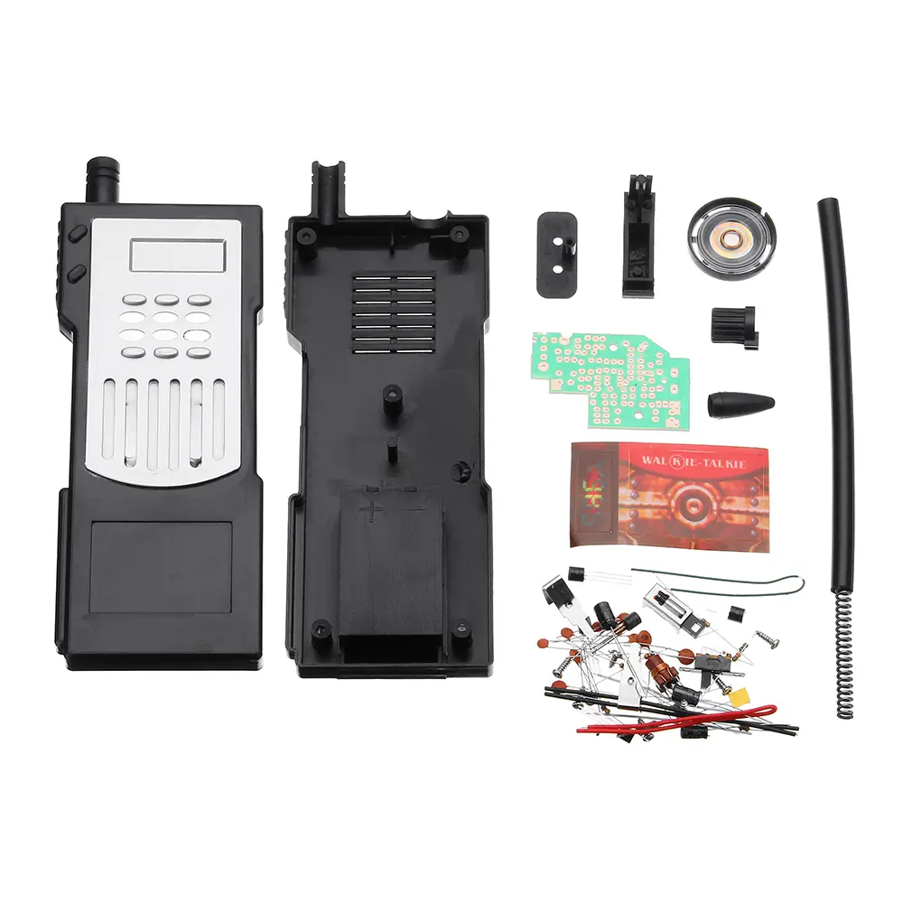
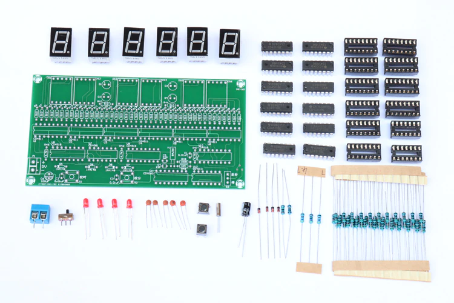

# Retro Electronics Kits
Project to upload documentation for, and to document the process of building retro DIY electronics kits.

### 1. HX108-2 - DIY Electronics AM Radio Kit

### 2. 986A - DIY Electronics Walkie Talkie Kit

### 3. DIY Electronics CMOS Clock Kit

