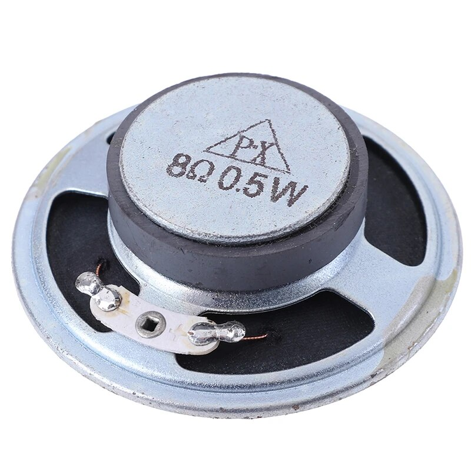

# HX108-2 - DIY Electronics AM Radio Kit

## Instructions from AliExpress

### Specification:

100% brand and high quality

Material: metal + plastic

Color: red

Size: approx. 122*66*26mm

Frequency Range: 525-1605KHz

Output Power: 100MW

Power Supply: 3V (No. 5 battery) (Not included)

Circuit theory introduction: the main properties of the 108-2 7 transistor radio frequency range: 525~1605KHZ

Speaker: approx. 57mm diameter, 8 ohm

### Feature:

Secondary intermediate standard circuit.

Has been adjusted in the 465KHz.

Circuit at all levels have Ic test port.

The whole machine contains 7 triodes, so it is called a 7-tube radio. Among them, the triode V1 is the frequency conversion tube, the V2 and V3 are the middle discharge tubes, the V4 is the detection tube, the V5 is the low frequency preamplifier tube, and the V6 and V7 are the low frequency power amplifier tubes.

Fine workmanship.

Easy to assemble.

Long service life.

Package included:1 set x Radio Electronic DIY Kit

### Note:

Please allow 0-1cm errors due to manual measurement.

This kit is for learning purposes only

Item color displayed in photos may be showing slightly different on your computer monitor since monitors are not calibrated same.

## Images from AliExpress

       

## Build Video by shango066

## Build Videos by The Radio Mechanic

## Build Videos by Lockdown Electronics

## Licenses

* HX108-2 Kit instructions copyrights owned by AliExpress.
* HX108-2 Kit images copyrights owned by AliExpress and Amazon.
* HX108-2 Kit Build Videos copyrights owned by shango066, The Radio Mechanic and Lockdown Electronics.
* All others are licensed CC0.

## References

* [HX108-2 Kit - Buy from AliExpress](https://www.aliexpress.us/item/3256801320386544.html)
* [HX108-2 Kit Build Video - By shango066](https://www.youtube.com/watch?v=XWtskDrjDgA)
* [HX108-2 Kit Build Videos - By The Radio Mechanic](https://www.youtube.com/watch?v=xlkX6mYQX9g)
* [HX108-2 Kit Build Videos - By Lockdown Electronics](https://www.youtube.com/watch?v=3tRV5sTdPt8)
* [HX108-2 Kit Build Log - By tardate](https://leap.tardate.com/radio/am/hx108-2/)

