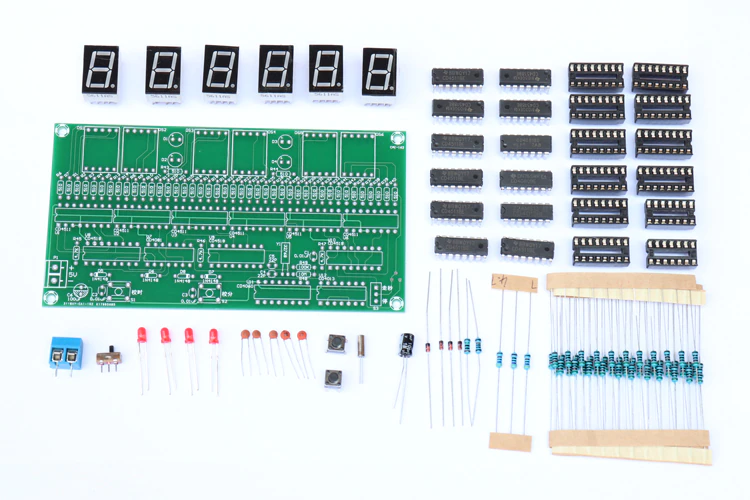
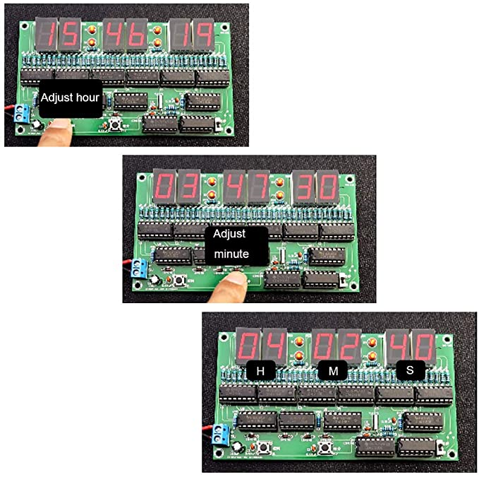

# DIY Electronics CMOS Clock
---

## Instructions from AliExpress

### Feature

1. Product describe: This circuit uses a quartz crystal oscillator as the time base pulse oscillator, and obtains the second time base signal after digital frequency division. The time is displayed by the counter, decoder and display. Because the crystal oscillator is used as the time base pulse, so the time is accurate.

2. circuit: Second, minute, and hour counter circuits use double BCD synchronous up counter CD4518 to count and output BCD code. The BCD code displays the corresponding number through CD4511. The second and minute counters are 60-digit count and 24-hour count.

3. PCB: 130x70mm double side. input voltage:5V.The circuit does not have a power-off memory time function, and the time needs to be recalibrated after power-off.

4. Required tools: electric iron: 30W-40W, solder wire: 0.8-1mm, Melting point is about 183 degrees Celsius. tweezers, oblique pliers, multimeter.

5. Suitable for electronic DIY electronic hobby beginners to learn and practice welding. It is widely used in schools to help students learn basic mechanical and electronic skills.

### spscs

* Resistor 510Ω: R1-R44 

* Resistor 4.7KΩ: R45, R46, R47 

* Resistor 100KΩ: R49 

* Resistor 100MΩ: R48 

* Diode 1N4148: D4, D6, D7, D8 

* Crystal 32768Hz: Y1 

* Porcelain capacitors 22pF: C4, C5 

* Ceramic capacitor 0.01uf: C1, C2, C3 

* Light-emitting diode LED: D1, D2, D3, D4 

* 16-pin IC socket: U1, U2, U3, U4, U5, U6, U8, U9, U10, U11 

* 14-pin IC socket: U11, U12 

* Toggle Switch SS12D00: S3 

* Tact Switch 6x6x5mm: S1, S2 

* Capacitor 100uf: C6 

* 0.56-inch 1-bit total negative red digital tube: DS1, DS2, DS3, DS4, DS5, DS6 

* PCB terminal KF301: P1 

* Integrated circuit CD4511 (decoding driver): U1, U2, U3, U4, U5, U6 

* Integrated circuit CD4518 (counter): U8, U9, U10 

* Integrated circuit CD4081 (4-2 input AND gate): U7 

* Integrated Circuit CD4060 (Oscillator Divider): U11 

* Integrated circuit CD4013 (D trigger): U12 

* PCB: 130x70mm double-sided 

### Features 

1. package include Component list，Please weld in the order of the component list. 

2. Resistor, crystal, ceramic capacitor, toggle switch, regardless of positive and negative 

3. Diode, capacitor, long pin is positive, corresponding to the position of the board + 

4. 1N4148 black circle corresponding board white mark position 

5. Integrated circuit and IC notch position corresponds to the position of the board notch 

6. The position where the tact switch can be normally loaded is correct.

## Images from AliExpress

         

## Images from Amazon

          

## Build Video by IMSAI Guy

## Licenses

* CMOS Clock Kit instructions copyrights owned by AliExpress.
* CMOS Clock Kit images copyrights owned by AliExpress and Amazon.
* CMOS Clock Kit Build Video copyrights owned by IMSAI Guy.
* All others are licensed CC0.

## References

* [CMOS Clock Kit - Buy from AliExpress](https://www.aliexpress.us/item/3256802496546510.html)
* [CMOS Clock Kit - Buy from Amazon](https://www.amazon.com/Electronic-Digital-Production-Training-Materials/dp/B0838BHP66/)
* [CMOS Clock Kit Build Video - By IMSAI Guy](https://www.youtube.com/watch?v=HGNogJdHMz8)

