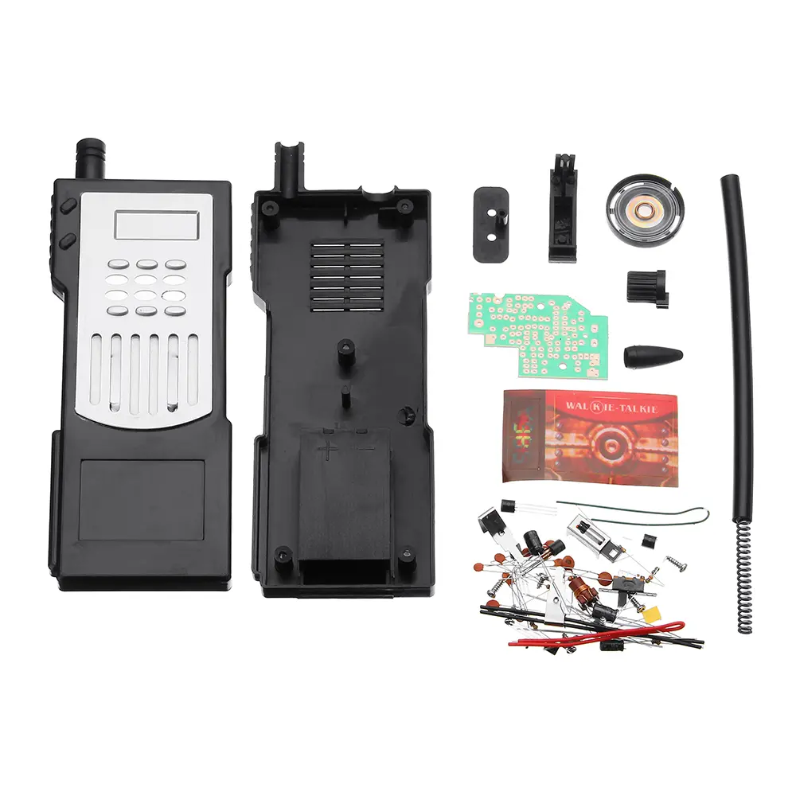

# 986A - DIY Electronics Walkie Talkie Kit

## Instructions from AliExpress

Intercom emission frequency is 49.8MHZ, uses 9V battery, intercom distance of up to one hundred meters, loud, good sound quality, suitable for lovers and Vocational School students assembled some electronic knowledge.
All electronic kits without power (battery)
   
### Circuit schematics and assembly instructions
 
#### Circuit theory
 
Transistor Q1 and adjustable inductor coil coupled T1, capacitor C4, C2 etc. oscillator circuit generates a frequency of about 49.8MHz carrier signal. Q2 Q3 Q4 Q5 and resistors and capacitors and other components related to the low-frequency amplifier. SPK1 doubles as a speaker microphone use. Circuit when receiving state, the transmit / receive switch to "receive" position (the default state to receive), received from the antenna ANT1 signal via antenna matching inductor L1, and then by an adjustable coupled inductor coil T1, capacitor C4 detection circuit, C2 and T1 secondary coil and other components will be detection. Audio signal after detection, by T1 secondary coil center tap coupled to the input of low-frequency amplifier, the amplified speaker driven by the coupling capacitor C17 SPK1 sound. When transmitting circuit state, S2 transmit / receive switch is pressed in the "letter" position, the voice into electrical signals by the speaker after the coupling capacitor C17 to Q2 Q3 Q4 Q5 and resistors and capacitors and other components related to the low-frequency amplification after amplification circuit, coupled to the adjustable center tap inductor oscillating signal is applied to transistor Q1 for signal modulation, so that the tube bc junction capacitance varies as a voice signal varies, and bc junction capacitance of the tube is connected in parallel with T1 across the secondary, so the frequency of the oscillating circuit also changes, to achieve the modulation of the function, and the modulated wave by the T1 and L1 transmitted from the antenna. 
 
#### Welding and installation, testing and adjustment
 
After receiving the kit, first carefully read the instructions, all the vitality into a container, resistors, capacitors and other small devices, to carefully identify the parameters, to prevent loss. Please take the circuit board edge by hand, do not take the face, hands and prevent dust from the circuit board oxidation.
 
All devices in vertical insertion, representing close to the circuit board, do not fall too high. Electrolytic capacitor, note that when the polarity of the transistor plug. Welded devices do not break, and on the vertical placement. After the board jumper J1 cut resistance welding wire instead, need a wire to the upper end of the toggle switch on the circuit board (SW1) at the link. Suite 6 wires, which are connected by way of access to the circuit as follows:
 
120 mm long wire: the battery negative to the circuit board (GND-) Department;
 
100 mm long wire: battery positive to the circuit board (VDD +) at;
 
Two 80 mm long wire: both ends of the speaker to the circuit board (SPK2) Department;
 
Two 50 mm long wire: one ear to the antenna terminal end of L1; one is a toggle switch in the middle-to-circuit board (SW2) place.
 
The antenna is mounted on the rotating sleeve black spring antenna, with screws and springs Wiring ear antenna fixed before the plastic shell and welded wire and circuit boards at L1.
 
After welding kits, after careful examination error, you can access 9V laminated battery, rotary toggle switch in New York, you can make the circuit power work, do not press the reset button, the circuit is in the "receiving" state, the speaker from the "power" into a "sound" effect, you can hear the "slightest" sound; the other set of reset button is pressed to make it work in the "letter" state, this time on the speaker "sound" into "power "the role of the two parallel sets of walkie-talkie antenna close, with no sense of screwdriver lightly trimming adjustable inductor core T1, the receiver of the" beep "howling maximum that both transmitter and receiver frequency unanimously. Then, two sets of interchangeable in the same manner as trimming adjustable inductor core of T1, to ensure both the transmit and consistent reception frequency. To fine-tune this process with each other a few times (including distance debugging), to ensure that the distance between the two sets of intercom farthest clearest sound.
 
After successful commissioning, installed "toggle switch plastic knobs" and "reset switch plastic button", with two screws on the board before the shell, cleaned up the wire, with five screws front cover fixed.
 
When in use, open the battery cover, and put on a 9V battery, rotary toggle switch Zealand, allows circuit power work, usually the circuit is in the "receiving" state, press the reset button, the circuit is in the "sender" state.
 
If installed, the power is no "trace" sound, please carefully check the power cord, speaker wire, vitality, etc. There is nothing wrong with welding, short circuit fault, must be carefully checked

## Images from AliExpress

     

## Images from Bangood

         

## Images from Yoycart

     

## Build Video by Julian Ilett

## Licenses

* 986A Kit instructions copyrights owned by AliExpress.
* 986A Kit images copyrights owned by AliExpress, Bangood and Yoycart.
* 986A Kit Build Videos copyrights owned by Julian Ilett.
* All others are licensed CC0.

## References

* [986A Kit - Buy from Bangood](https://usa.banggood.com/DIY-Electronic-Walkie-talkie-Production-Kit-Starter-Kits-Welding-Experiment-Training-Kit-p-1425012.html)
* [986A Kit - Buy from AliExpress](https://www.aliexpress.us/item/2251832083509560.html)
* [986A Kit Assembled - Buy from Yoycart.
](https://www.yoycart.com/Product/38963939598/)
* [986A Kit Build Videos - By Julian Ilett](https://www.youtube.com/playlist?list=PLjzGSu1yGFjVw27NNjBR_pjBV0vUG9Ndu)
